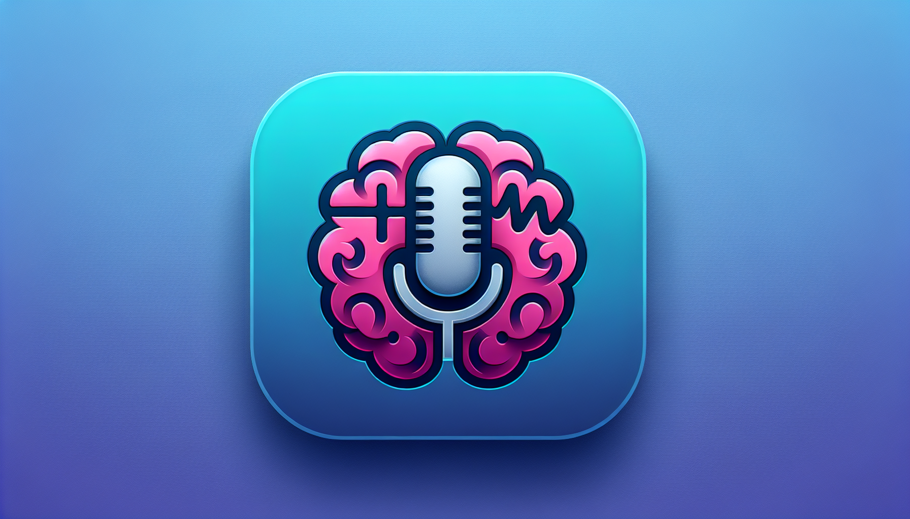

<div id="top">

<!-- HEADER STYLE: CLASSIC -->
<div align="center">



# PARKINSON-DISEASE-DETECTION-WITH-AUDIO

<em>Hear Early, Act Faster, Change Lives Now</em>

<!-- BADGES -->


<em>Built with the tools and technologies:</em>


<br>


</div>
<br>

---

## Table of Contents

- [Overview](#overview)
- [Getting Started](#getting-started)
    - [Prerequisites](#prerequisites)
    - [Installation](#installation)
    - [Usage](#usage)
    - [Testing](#testing)
- [Roadmap](#roadmap)
- [Contributing](#contributing)
- [License](#license)
- [Acknowledgment](#acknowledgment)

---

## Overview

Parkinson-Disease-Detection-with-Audio is an open-source developer toolkit designed to facilitate early detection of Parkinson's disease through speech analysis. It combines advanced audio processing, machine learning models, and web deployment to create a seamless diagnostic system. 

**Why Parkinson-Disease-Detection-with-Audio?**

This project aims to streamline the development of audio-based health diagnostics. The core features include:

- **🧩** *Audio Feature Extraction:* Comprehensive acoustic and voice quality analysis from audio recordings.
- **🚀** *End-to-End Web App:* User-friendly interface for uploading audio files and receiving predictions.
- **🤖** *Machine Learning Pipeline:* Data preprocessing, augmentation, training, and evaluation of neural network models.
- **🔧** *Deployment & Automation:* CI/CD workflows for reliable deployment to cloud environments.
- **🎯** *Developer-Focused:* Modular codebase supporting easy customization and integration.

---

## Getting Started

### Prerequisites

This project requires the following dependencies:

- **Programming Language:** HTML
- **Package Manager:** Pip

### Installation

Build Parkinson-Disease-Detection-with-Audio from the source and install dependencies:

1. **Clone the repository:**

    ```sh
    ❯ git clone https://github.com/vpatel2398/Parkinson-Disease-Detection-with-Audio
    ```

2. **Navigate to the project directory:**

    ```sh
    ❯ cd Parkinson-Disease-Detection-with-Audio
    ```

3. **Install the dependencies:**

**Using [pip](https://pypi.org/project/pip/):**

```sh
❯ pip install -r requirements.txt
```

### Usage

Run the project with:

**Using [pip](https://pypi.org/project/pip/):**

```sh
python {entrypoint}
```

### Testing

Parkinson-disease-detection-with-audio uses the {__test_framework__} test framework. Run the test suite with:

**Using [pip](https://pypi.org/project/pip/):**

```sh
pytest
```

---

<summary>Contributing Guidelines</summary>

1. **Fork the Repository**: Start by forking the project repository to your github account.
2. **Clone Locally**: Clone the forked repository to your local machine using a git client.
   ```sh
   git clone https://github.com/vpatel2398/Parkinson-Disease-Detection-with-Audio
   ```
3. **Create a New Branch**: Always work on a new branch, giving it a descriptive name.
   ```sh
   git checkout -b new-feature-x
   ```
4. **Make Your Changes**: Develop and test your changes locally.
5. **Commit Your Changes**: Commit with a clear message describing your updates.
   ```sh
   git commit -m 'Implemented new feature x.'
   ```
6. **Push to github**: Push the changes to your forked repository.
   ```sh
   git push origin new-feature-x
   ```
7. **Submit a Pull Request**: Create a PR against the original project repository. Clearly describe the changes and their motivations.
8. **Review**: Once your PR is reviewed and approved, it will be merged into the main branch. Congratulations on your contribution!
</details>

<details closed>
<summary>Contributor Graph</summary>
<br>
<p align="left">
   <a href="https://github.com{/vpatel2398/Parkinson-Disease-Detection-with-Audio/}graphs/contributors">
      
   </a>
</p>
</details>

---

## License

Parkinson-disease-detection-with-audio is protected under the [LICENSE](https://choosealicense.com/licenses) License. For more details, refer to the [LICENSE](https://choosealicense.com/licenses/) file.

---


<div align="left"><a href="#top">⬆ Return</a></div>

---
